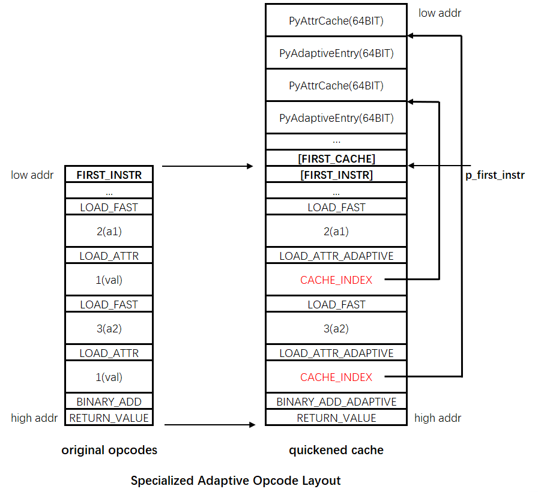
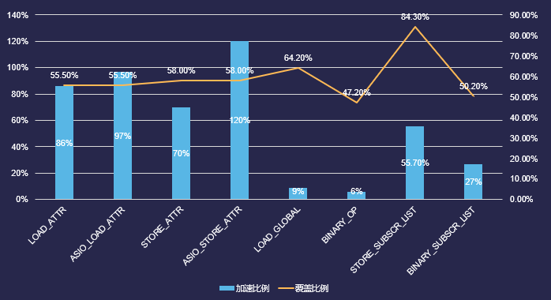

# 这是什么
**Python Specilized Adaptive Interpreter**是在Python2.7上实现的特化自适应解释器，该解释器移植了官方在Python3.11上实现的特化自适应解释器的特性，能够提升python解释器的运行时效率。可以在这里看到最新的官方特性：[python3.11 a7](https://www.python.org/downloads/release/python-3110a7/)，当前python版本为2.7.14

我们移植了python3.11中实现的绝大多数字节码优化，在单个字节码上最多能达到性能翻倍的效果，此外还针对**C++扩展的类型**做了额外的支持，使引擎层对property的读写性能都有了同等幅度的提升。

经过测试，该优化在S3项目中能为python带来12%的性能优化。

# 实现原理与特性
## 概述
Python特化自适应解释器通过缓存字节码执行时的上下文环境，来达到加速执行的目的
这个原理基于一个假设：字节码的上下文环境如果在多次执行中是稳定的，那么就可以将其缓存下来。这里的上下文环境既包括字节码对应的参数类型，也包括对象的字典环境。

比如python中的加法，针对不同的数据类型有不同的实现，需要在运行的时候去分析参数类型来决定不同的处理方法，这个过程本身是有一定开销的。
对于特定的字节码，假如每次执行的时候，他的参数类型都是相同的，那么就可以直接去执行最后的运算逻辑，而不用做类型的判断跟转换，这样就能提高运行时的性能。

我们实现了字节码级别的运行时开关，运行过程中随时可以开启跟关闭任何一个支持的字节码，方便做性能对比和问题排查；
另外这套方案支持引擎向前兼容，新增一个特化的字节码，可以完全支持新老包的并存，新包使用特化的字节码，老包使用原来的字节码，逻辑层不需要做任何额外的操作，对线上更新很友好。

接下来我们来深入谈谈技术原理，为了说清楚这件事情，我们从一段代码开始：

```
class A(object):
  def __init__(self, v):
    super(A, self).__init__()
    self.val = v


def func(x, y):
  a1 = A(x)
  a2 = A(y)
  return a1.val + a2.val
```

其中func这个函数在反编译后，可以看到他的字节码长这个样子：

```
>>> dis.dis(func)
  2           0 LOAD_GLOBAL              0 (A)
              3 LOAD_FAST                0 (x)
              6 CALL_FUNCTION            1
              9 STORE_FAST               2 (a1)

  3          12 LOAD_GLOBAL              0 (A)
             15 LOAD_FAST                1 (y)
             18 CALL_FUNCTION            1
             21 STORE_FAST               3 (a2)

  4          24 LOAD_FAST                2 (a1)
             27 LOAD_ATTR                1 (val)
             30 LOAD_FAST                3 (a2)
             33 LOAD_ATTR                1 (val)
             36 BINARY_ADD
             37 RETURN_VALUE
```

以上字节码被保存在PyCodeObject对象中，具体存放在co_code这个字段内：
```
/* Bytecode object */
typedef struct {
    PyObject_HEAD
    // ...
    PyObject *co_code;		/* instruction opcodes */
    // ...
} PyCodeObject;
```

特化自适应解释器，会在运行时把PyCodeObject中的字节码根据上下文环境替换为不同的字节码，以便达到加速的效果，这个过程就叫做**特化**。我们先把关注点放到BINARY_ADD这句上来，看看他的执行流程，并分析这其中有什么优化的可能性。

### Inside BINARY_ADD

BINARY_ADD在python2.7 [ceval.c](src/Python/ceval.c)中，简化后的代码如下，这里判断了参与相加的两个变量的类型，并做了一些特殊处理：
1. 如果两个PyObject同为Int类型，则直接转换为PyIntObject，然后做整型相加操作
2. 如果两个PyObject同为String类型，则直接转换为PyStringObject，然后做字符串连接操作
3. 否则，会调用PyNumber_Add函数
```
TARGET_NOARG(BINARY_ADD)
{
	PREDICTED_ID(BINARY_ADD);
    w = POP();
    v = TOP();
    if (PyInt_CheckExact(v) && PyInt_CheckExact(w)) {
        /* INLINE: int + int */
        register long a, b, i;
        a = PyInt_AS_LONG(v);
        b = PyInt_AS_LONG(w);
        i = (long)((unsigned long)a + b);
        x = PyInt_FromLong(i);
    }
    else if (PyString_CheckExact(v) &&
             PyString_CheckExact(w)) {
        x = string_concatenate(v, w, f, next_instr);
    }
    else {
	slow_add:
        x = PyNumber_Add(v, w);
    }
    // ...
}
```

Number_Add这个函数，他先尝试对两个数做加法(nb_add)，如果无法相加，则继续尝试对他们做连接操作(sq_concat)。
```
PyObject *
PyNumber_Add(PyObject *v, PyObject *w)
{
    PyObject *result = binary_op1(v, w, NB_SLOT(nb_add));
    if (result == Py_NotImplemented) {
        PySequenceMethods *m = v->ob_type->tp_as_sequence;
        Py_DECREF(result);
        if (m && m->sq_concat) {
            return (*m->sq_concat)(v, w);
        }
        result = binop_type_error(v, w, "+");
    }
    return result;
}
```

binary_op1的代码就非常复杂了，这里不做展开（其实我也没细看），大意就是对加法的两个参数分别作各种判断，来决定他们是否能执行“加法”这个操作
```
static PyObject *
binary_op1(PyObject *v, PyObject *w, const int op_slot)
{
    PyObject *x;
    binaryfunc slotv = NULL;
    binaryfunc slotw = NULL;

    if (v->ob_type->tp_as_number != NULL && NEW_STYLE_NUMBER(v))
        slotv = NB_BINOP(v->ob_type->tp_as_number, op_slot);
    if (w->ob_type != v->ob_type &&
        w->ob_type->tp_as_number != NULL && NEW_STYLE_NUMBER(w)) {
        slotw = NB_BINOP(w->ob_type->tp_as_number, op_slot);
        if (slotw == slotv)
            slotw = NULL;
    }
    if (slotv) {
        if (slotw && PyType_IsSubtype(w->ob_type, v->ob_type)) {
            x = slotw(v, w);
            if (x != Py_NotImplemented)
                return x;
            Py_DECREF(x); /* can't do it */
            slotw = NULL;
        }
        x = slotv(v, w);
        if (x != Py_NotImplemented)
            return x;
        Py_DECREF(x); /* can't do it */
    }
    if (slotw) {
        x = slotw(v, w);
        if (x != Py_NotImplemented)
            return x;
        Py_DECREF(x); /* can't do it */
    }
    if (!NEW_STYLE_NUMBER(v) || !NEW_STYLE_NUMBER(w)) {
        int err = PyNumber_CoerceEx(&v, &w);
        if (err < 0) {
            return NULL;
        }
        if (err == 0) {
            PyNumberMethods *mv = v->ob_type->tp_as_number;
            if (mv) {
                binaryfunc slot;
                slot = NB_BINOP(mv, op_slot);
                if (slot) {
                    x = slot(v, w);
                    Py_DECREF(v);
                    Py_DECREF(w);
                    return x;
                }
            }
            /* CoerceEx incremented the reference counts */
            Py_DECREF(v);
            Py_DECREF(w);
        }
    }
    Py_INCREF(Py_NotImplemented);
    return Py_NotImplemented;
}
```

看到这里，我们会得出一个基本的结论：看似简单的一个加法，因为要支持PyObject的各种类型，变得非常冗长，所以**PyNumber_Add很慢**。

回到ceval.c中BINARY_ADD的逻辑，我们马上可以理解这里为什么要写两段类型判断：**对于两个Int或者两个String的加法运算，省去后面繁琐的类型判断，只执行核心逻辑，提高运行时效率**。这其实就可以理解为一种对类型的特化，可见Python之父在写这段代码的时候，已经想要一定程度上提升性能。

遗憾的是，在Python3中，这些特化的代码都被干掉了，留下的是被抽象得很好的逻辑：
```
static const binaryfunc binary_ops[] = {
    [NB_ADD] = PyNumber_Add,
    [NB_AND] = PyNumber_And,
    [NB_FLOOR_DIVIDE] = PyNumber_FloorDivide,
    [NB_LSHIFT] = PyNumber_Lshift,
    [NB_MATRIX_MULTIPLY] = PyNumber_MatrixMultiply,
    [NB_MULTIPLY] = PyNumber_Multiply,
    // ...
};

TARGET(BINARY_OP) {
	PREDICTED(BINARY_OP);
	PyObject *rhs = POP();
	PyObject *lhs = TOP();
	PyObject *res = binary_ops[oparg](lhs, rhs);
	Py_DECREF(lhs);
	Py_DECREF(rhs);
	SET_TOP(res);
	DISPATCH();
}
```

Python之父后来终于意识到性能问题的重要性，开始着手解决这些问题。他会把BINARY_ADD在python2.7中的特殊处理加回来吗？当然不会，BINARY_OP只是性能问题中很小的一部分，他需要设计一套更通用的框架，来解决广泛存在于Python虚拟机中性能问题。

### 运行时字节码替换

我们同样先从BINARY_ADD开始，这里加入新的字节码来处理两个PyFloatType相加的情况：
```
#define BINARY_ADD_ADAPTIVE 16
#define BINARY_ADD_FLOAT 18
```

在func函数执行的时候，虚拟机会通过**WarmUp**机制将BINARY_ADD替换为BINARY_ADD_ADAPTIVE：
```
>>> dis.dis(func)
  2           0 LOAD_GLOBAL              0 (A)
              3 LOAD_FAST                0 (x)
              6 CALL_FUNCTION            1
              9 STORE_FAST               2 (a1)

  3          12 LOAD_GLOBAL              0 (A)
             15 LOAD_FAST                1 (y)
             18 CALL_FUNCTION            1
             21 STORE_FAST               3 (a2)

  4          24 LOAD_FAST                2 (a1)
             27 LOAD_ATTR                1 (val)
             30 LOAD_FAST                3 (a2)
             33 LOAD_ATTR                1 (val)
             36 **BINARY_ADD_ADAPTIVE**
             37 RETURN_VALUE
```

注意，这个时候BINARY_ADD还没有被特化，他只是被标记为待特化的字节码，具体的特化时机其实是在BINARY_ADD_ADAPTIVE被执行到的时候，具体逻辑被封装在**\_PySpecialize\_BinaryAdd**里：

```
TARGET_NOARG(BINARY_ADD_ADAPTIVE) {
	PyObject *left = SECOND();
	PyObject *right = TOP();
	next_instr--;
	// 具体的特化逻辑是在下面这个_Py_Specialize_BinaryAdd函数中
	if (_Py_Specialize_BinaryAdd(left, right, next_instr) < 0) {
		PyErr_SetString(PyExc_RuntimeError, "runtime error in BINARY_ADD_ADAPTIVE!");
		goto on_error;
	}
	DISPATCH();
}
```

**\_Py\_Specialize\_BinaryAdd**中，会判断加法操作的的两个参数是否都是PyFloat类型，如果是则将字节码替换为BINARY_ADD_FLOAT

```
int _Py_Specialize_BinaryAdd(PyObject *left, PyObject *right, _Py_CODEUNIT *instr)
{
	PyTypeObject *left_type = Py_TYPE(left);
	if (left_type == &PyFloat_Type) {
		_Py_MAKECODEUNIT_NOARG(instr, BINARY_ADD_FLOAT);
		goto success;

	}
	else {
		SPECIALIZATION_FAIL(BINARY_ADD, SPEC_FAIL_OTHER);
	}
fail:
	_Py_MAKECODEUNIT_NOARG(instr, BINARY_ADD);
	return 0;
success:
	return 0;
}
```

BINARY_ADD_FLOAT里就可以直接把两个参数转换为PyFloatObject来处理了，不需要调用PyNumber_Add，避免了繁琐的类型判断

宏DEOPT_IF用来处理当类型预测失败的时候，回退到旧的BINARY_ADD逻辑
```
TARGET_NOARG(BINARY_ADD_FLOAT) {
	PyObject *left = SECOND();
	PyObject *right = TOP();

	DEOPT_IF(!PyFloat_CheckExact(left), BINARY_ADD);
	DEOPT_IF(Py_TYPE(right) != Py_TYPE(left), BINARY_ADD);

	double dsum = ((PyFloatObject *)left)->ob_fval + ((PyFloatObject *)right)->ob_fval;
	PyObject *sum = PyFloat_FromDouble(dsum);

	SET_SECOND(sum);
	Py_DECREF(right);
	Py_DECREF(left);
	STACK_SHRINK(1);

	DISPATCH();
}
```

以上这就是字节码替换的主要实现原理了，是不是看起来好像还不如直接在BINARY_ADD里补一个if？别着急，这只是热个身，真正精彩的部分在后面，特化自适应解释器最精彩的部分藏在他的缓存里，这个特化效果最显著的部分就是基于缓存的特化，这个接下来进行说明。

### 参数缓存

特化自适应解释器并不是在原始的字节码上进行内容的替换，而是开辟一块新的内存空间，将原始的字节码拷贝一份出来，再进行替换，这会产生不太多的额外内存开销。至于为什么不直接在原始内存上直接替换，其中一个原因就是我们除了需要对字节码进行替换以外，还需要使用额外的Cache来存储更多的信息，原始字节码中，用于存储参数的部分被替换为指向Cache入口的索引。

原始的字节码与特化后字节码在内存中的布局关系如下图所示，这段连续的内存空间中，高地址存储了特化后的字节码序列，低地址用于存储特化字节码需要的Cache数据。这段新的内存地址，通过在PyCodeObject中新增一个字段(co_quickened)来维护，同时还新增了指向这段内存中第一个字节码的指针(co_firstinstr)：

```
/* Bytecode object */
typedef struct {
    PyObject_HEAD
    // ...
    PyObject *co_code;		/* instruction opcodes */
    // ...
    /* Pointer to first instruction, used for quickening.
	Unlike the other "hot" fields, this one is
	actually derived from co_code. */
	_Py_CODEUNIT *co_firstinstr; 

	/* Quickened instructions and cache, or NULL
	 This should be treated as opaque by all code except the specializer and
	 interpreter. */
	union _cache_or_instruction *co_quickened;
} PyCodeObject;
```

从图中可以看出，特化自适应解释器做了下列修改：
1. 新增一段Cache内存
2. OPCODE -> ADAPTIVE_OPCODE
3. OPARG -> CACHE INDEX，该CACHE INDEX指向OPCODE占用的第一个Cache，这些Cache按照高地址到低地址的方式依次被使用。



Cache有多种类型，用以支持不同OPCODE的特化参数，每个Cache占用的大小都是固定的(8 bytes)，这是为了方便在特化的时候计算Cache的用量。当前支持的Cache类型有如下这些：
```
/* Add specialized versions of entries to this union.
 *
 * Do not break the invariant: sizeof(SpecializedCacheEntry) == 8
 * Preserving this invariant is necessary because:
    - If any one form uses more space, then all must and on 64 bit machines
      this is likely to double the memory consumption of caches
    - The function for calculating the offset of caches assumes a 4:1
      cache:instruction size ratio. Changing that would need careful
      analysis to choose a new function.
 */
typedef union {
    _PyEntryZero zero;
    _PyAdaptiveEntry adaptive;
    _PyAttrCache attr;
    _PyLoadGlobalCache load_global;
    _PyObjectCache obj;
    _PyCallCache call;
} SpecializedCacheEntry;
```

如果一个OPCODE使用了Cache，则第一个Cache一定是**PyAdaptiveEntry**，后面的Cache类型根据不同的字节码可以自行定制，**PyAdaptiveEntry**的定义如下：

```
typedef struct {
    uint16_t original_oparg;  // 存储原始的oparg
    uint8_t counter;          // 这是一个计数器，用于特化预测失败后的计数与回退
	uint8_t reserved8;        // 这是一个保留字段，留给不同的C++扩展类来使用
	uint16_t index;           // 用于存储__dict__的索引
	uint16_t any_version16;   // 用于记录当前cache的版本号
} _PyAdaptiveEntry;
```

LOAD_ATTR的逻辑比较复杂，根据不同的情况，会被特化为不同的字节码，到目前为止，我们实现了3种情况的特化。跟BINARY_ADD一样，在特化的开始，LOAD_ATTR会被修改为LOAD_ATTR_ADAPTIVE，接下来在每个LOAD_ATTR被执行到的时候，根据结果的不同被特化为不同的字节码。

```
#define LOAD_ATTR_ADAPTIVE 151
#define LOAD_ATTR_GETSET_OVERRIDDEN 152  // 支持C++扩展类型的特化
#define LOAD_ATTR_INSTANCE_VALUE 153     // 对象内成员变量的特化，如a.x
#define LOAD_ATTR_CLASS_VALUE 154        // 类变量与类方法的特化，如A.func
```

这里需要从入口**LOAD_ATTR**开始，梳理清楚查找一个属性的全流程，才能明白这样划分的原因，这里以"a.x"为例，简单解释一下LOAD_ATTR的执行流程：

1. 从栈顶获取需对象的索引(PyObject, 对应a.x中的a)
2. oparg当做索引，从co_names字段中获取属性名字(PyStringObject，对应a.x中的字符串"x")
3. 尝试从对象的__dict__中查找"x" (a.__dict__['x'])，如果查到则返回
4. 尝试从对象的类身上查找"x" (PyType\_Lookup)，如果查到则返回
5. 抛出找不到属性的异常。

这是一个简化的流程版本，其中步骤3是查找对象身上是否有该成员变量，这里面开销最大的部分是通过一系列计算查找到PyDictEntry的地址(这里保存了属性的值) 如果能查到结果，最终就会对特化为**LOAD_ATTR_INSTANCE_VALUE**。

这个特化需要缓存的内容有两个：PyDictEntry的下标(缓存在index中)，以及dict的version（缓存在any_version16中)，特化后的版本可以直接查找到属性对应的PyDictEntry对象，并返回结果。

经过在S3项目的实测，该优化能够为LOAD_ATTR带来**86%的性能提升**，执行效率基本翻倍。

```
// 为了便于理解，这段代码去除了预测失败的判断，只保留核心的逻辑，完整代码请直接查看源文件。

TARGET(LOAD_ATTR_INSTANCE_VALUE) {
	SpecializedCacheEntry *cache = GET_CACHE();
	PyObject *owner = TOP();
	PyObject *res;
	PyTypeObject *tp = Py_TYPE(owner);
	PyObject *name = GETITEM(names, cache->adaptive.original_oparg);

	_PyAdaptiveEntry *cache0 = &cache[0].adaptive;

	PyObject **dictptr = (PyObject **)((char *)owner + tp->tp_dictoffset);
	PyObject *dict = *dictptr;

	PyDictObject* mp = (PyDictObject*)dict;
	DEOPT_IF(cache0->index >= mp->ma_fill, LOAD_ATTR);
	PyDictEntry *ep = &mp->ma_table[cache0->index];

	res = ep->me_value;
	Py_INCREF(res);
	SET_TOP(res);
	Py_DECREF(owner);

	DISPATCH();
}
```

### WarmUp机制

由于特化自适应解释器需要额外的内存开销，因此Python之父并不打算一上来就为所有指令开启特化，出于对时间和空间的折中考虑，他增加了一套WarmUp机制，用来决定为哪些PyCodeObject做特化。

WarmUp人如其名，为完成“热身”的代码执行特化操作。完成“热身”的定义非常简单：如果一段代码执行足够多的次数，则认为这段代码在未来的程序生命内也会持续被执行，这样的代码就应该被特化。关键代码摘录如下。

值得一提的是，\_Py\_Quciken这个函数，就是初始化co_quickened，并将BINARY_ADD替换为BINARY_ADD_ADAPTIVE，以及将LOAD_ATTR替换为LOAD_ATTR_ADAPTIVE的地方

```
// 在PyEval_EvalFrameEx中，当PyCodeObject被执行的时候，尝试为其热身跟加速
if (!PyCodeObject_IsWarmedUp(co)) {
	PyCodeObject_IncrementWarmup(co);
	if (PyCodeObject_IsWarmedUp(co)) {
		if (_Py_Quicken(co)) {
			goto exit_eval_frame;
		}
	}
}

// 为PyCodeObject做热身
static inline void
PyCodeObject_IncrementWarmup(PyCodeObject * co)
{
    co->co_warmup++;
}

// 检查PyCodeObject是否完成了热身
static inline int
PyCodeObject_IsWarmedUp(PyCodeObject * co)
{
    return (co->co_warmup == 0);
}

// Python之父给出了8这个神秘数字
#define QUICKENING_WARMUP_DELAY 8

// co->co_warmup被初始化成这个值
#define QUICKENING_INITIAL_WARMUP_VALUE (-QUICKENING_WARMUP_DELAY)
```

### 预测失败的处理

特化的原理是基于对字节码参数或者上下文的预测，来减少中间重复的计算，如果预测失败，那么特化的逻辑就不再可用，此时需要**回退**到原始的OPCODE处理逻辑。

Python之父设计了一个counter字段用来管理回退的逻辑，这个字段藏在Cache中。以LOAD_ATTR_XXX为例，发生预测失败的时候，流程如下：
1. counter--;
2. if (counter == 0): LOAD_ATTR_XXX 变为 LOAD_ATTR_ADAPTIVE，并且把counter回复为初始值
3. goto LOAD_ATTR

该流程被封装在一个叫做**DEOPT_IF**的宏里面，counter的初始值是个神秘的53，也就意味着，只有当预测失效53次之后，才会把LOAD_ATTR_XXX重新退化为LOAD_ATTR_ADAPTIVE，在此之前，都会假设预测是有效的。按照python之父的解释，如果这个值太小就会过早中止优化（去除特化），让后续的代码得不到优化的机会，从而降低性能；如果这个值太大，则可能产生太多次的预测失效，从而降低性能。（是不是很奇怪的解释，翻译过来就是：拍脑袋拍出来一个53，别问为什么）
```
static inline int
initial_counter_value(void) {
	/* Starting value for the counter.
	 * This value needs to be not too low, otherwise
	 * it would cause excessive de-optimization.
	 * Neither should it be too high, or that would delay
	 * de-optimization excessively when it is needed.
	 * A value around 50 seems to work, and we choose a
	 * prime number to avoid artifacts.
	 */
	return 53;
}
```

在退化为LOAD_ATTR_ADAPTIVE之后，接下来的执行流程就是这样的，由于counter被从新恢复为了53，因此在接下来的53次里，都会进入else分支，也就是跳转到LOAD_ATTR去执行原始逻辑，在这之后，才会走第一个if分支，尝试重新特化(**\_Py_Specialize_LoadAttr**)：
```
TARGET(LOAD_ATTR_ADAPTIVE) {
	SpecializedCacheEntry *cache = GET_CACHE();
	if (cache->adaptive.counter == 0) {
		PyObject *owner = TOP();
		PyObject *name = GETITEM(names, cache->adaptive.original_oparg);
		next_instr -= 3;

		if (_Py_Specialize_LoadAttr(owner, next_instr, name, cache) < 0) {
			PyErr_SetString(PyExc_RuntimeError, "runtime error in LOAD_ATTR_ADAPTIVE!");
			goto on_error;
		}
		DISPATCH();
	}
	else {
		cache->adaptive.counter--;
		oparg = cache->adaptive.original_oparg;
		JUMP_TO_INSTRUCTION(LOAD_ATTR);
	}
}
```

然而我要说的是，这个counter并没有达到他所说的目的，至少**对LOAD_ATTR跟STORE_ATTR来讲，这个逻辑有些多余**。

为什么这么说呢，我们先来看看完整版LOAD_ATTR_INSTANCE_VALUE处理逻辑，跟上面的代码相比，这里恢复了所有对预测失败的判断(DEOPT_IF)。

```
TARGET(LOAD_ATTR_INSTANCE_VALUE) {
	SpecializedCacheEntry *cache = GET_CACHE();
	PyObject *owner = TOP();
	PyObject *res;
	PyTypeObject *tp = Py_TYPE(owner);
	PyObject *name = GETITEM(names, cache->adaptive.original_oparg);

	DEOPT_IF(!PyString_CheckExact(name), LOAD_ATTR);

	_PyAdaptiveEntry *cache0 = &cache[0].adaptive;
	DEOPT_IF(tp->tp_dictoffset <= 0, LOAD_ATTR);

	PyObject **dictptr = (PyObject **)((char *)owner + tp->tp_dictoffset);
	PyObject *dict = *dictptr;
	DEOPT_IF(dict == NULL, LOAD_ATTR);

	PyDictObject* mp = (PyDictObject*)dict;
	DEOPT_IF(cache0->index >= mp->ma_fill, LOAD_ATTR);
	PyDictEntry *ep = &mp->ma_table[cache0->index];

	DEOPT_IF(ep == NULL, LOAD_ATTR);
	
	DEOPT_IF(ep->me_key != name, LOAD_ATTR);

	ADAPTIVE_OPCODE_RECORD(LOAD_ATTR, hits);
	res = ep->me_value;
	Py_INCREF(res);

	SET_TOP(res);

	Py_DECREF(owner);
	DISPATCH();
}
```

我们不妨脑补一下，假设某一条LOAD_ATTR_INSTANCE_VALUE因为任何一个原因执行失败了，这个时候还需要再给他机会在后面继续执行这段特化逻辑吗？**完全没有必要，上一次失败在那一句DEOPT_IF，这次依然会在相同的地方失败，每次都会重复走失败回退的流程，不会有成功的可能性**。

我们对此做了修改，**废弃了counter**，改动后的逻辑更简单了，发生预测失败的时候，流程如下：
1. counter = 0
2. LOAD_ATTR_XXX 变为 LOAD_ATTR_ADAPTIVE
3. goto LOAD_ATTR

改动过后，当这句LOAD_ATTR_XXX在下一次被执行的时候，走的就是LOAD_ATTR_ADAPTIVE，此时因为counter已经被设置为0，因此会立刻尝试重新特化(**\_Py_Specialize_LoadAttr**)：

重新特化有3个结果：
1. 特化成功，LOAD_ATTR_ADAPTIVE -> LOAD_ATTR_XXX，立刻进入优化流程
2. 特化失败，counter = 53，接下来的53次里，会进入LOAD_ATTR_ADAPTIVE的else分支，冷静一下。
3. 特化永久失败（不支持的特化类型），LOAD_ATTR_ADAPTIVE -> LOAD_ATTR，永久退化，从今往后这条OPCODE不会再走特化逻辑。

再回顾一下代码
```
TARGET(LOAD_ATTR_ADAPTIVE) {
	SpecializedCacheEntry *cache = GET_CACHE();
	if (cache->adaptive.counter == 0) {
		PyObject *owner = TOP();
		PyObject *name = GETITEM(names, cache->adaptive.original_oparg);
		next_instr -= 3;

		if (_Py_Specialize_LoadAttr(owner, next_instr, name, cache) < 0) {
			PyErr_SetString(PyExc_RuntimeError, "runtime error in LOAD_ATTR_ADAPTIVE!");
			goto on_error;
		}
		DISPATCH();
	}
	else {
		cache->adaptive.counter--;
		oparg = cache->adaptive.original_oparg;
		JUMP_TO_INSTRUCTION(LOAD_ATTR);
	}
}
```

对比一下变动后的逻辑，可以认为去掉了前面52次无用的LOAD_ATTR_XXX的尝试，并让这句字节码尽快进入特化流程，和原有逻辑相比，节省了很多无用的步骤。实测结果表明，counter为0或者为53，对性能数据并无显著变化。

### C++扩展对象支持

如果自定义的C++扩展类型自己实现了getattro与setattro，那么就需要重新实现特化访问接口，以便能提高访问效率（除非自己实现的接口效率极高，无需优化）。比如asiocore中的area_map与entity，这两个类重写了这两个接口，并且接口的效率和原始的接口不相上下（有时还会更慢），因此有必要进行针对性的优化。

我们为PyTypeObject引入三个新的函数指针，用来支持C++扩展对象的LOAD_ATTR/STORE_ATTR支持，自定义的类型只要提供这三个接口，就能拥有特化与加速的能力：

```

// 三个函数接口的定义如下
typedef PyObject* (*adaptive_getattrofunc)(PyObject*, PyObject*, void*); // owner, key, cache
typedef int (*adaptive_setattrofunc)(PyObject*, PyObject*, PyObject*, void*); // owner, key, value, cache
typedef int (*adaptive_specializedictaccessfunc)(PyObject*, PyObject*, void*, int); // owner, key, cache, store

// 他们被安置在PyTypeObject的末尾
typedef struct _typeobject {
    PyObject_VAR_HEAD
        const char* tp_name; /* For printing, in format "<module>.<name>" */
    Py_ssize_t tp_basicsize, tp_itemsize; /* For allocation *

    // ...

    /*
    Return PyObject* if cache hit
    Return NULL if cache miss OR error occurred
    You need to check PyErr_Occurred on NULL returned
	should returns NEW reference
    */
    adaptive_getattrofunc tp_adaptive_getattro;   // GETATTR的特化访问接口

    /*
    Return 0 if cache hit
    Return 1 if cache miss
    Return -1 on error occurred
    */
    adaptive_setattrofunc tp_adaptive_setattro;   // SETATTR的特化访问接口

    /*
    */
    adaptive_specializedictaccessfunc tp_adaptive_specializedictaccess;    // 用于特化流程中初始化Cache的接口
} PyTypeObject;
```

#### 

# 性能数据
各个字节码的性能提升数据以及优化覆盖率如下图所示
注意此处包含了两个特殊的项目：**ASIO_LOAD_ATTR**与**ASIO_STORE_ATTR**这并非两个独立的字节码，而是为LOAD_ATTR与STORE_ATTR的在C++扩展类型上做的额外支持，该支持是实现在Messiah Asiocore中的，为AreaMap提供了专门的优化支持，基于AreaMap特别的实现方式，该优化能够带来比原始字节码更大幅度的优化。



# 接入方法

该版本的改动主要包括以下几个文件：

| 文件列表  | 改动说明 |
| ------------- |:-------------:|
| specialize.c      | 特化自适应逻辑的核心文件，包含了特化opcode的替换与cache的填充     |
| ceval.c      | 增加了特化部分opcode的实现，以及原始opcode与特化opcode的之间的跳转逻辑     |
| opcode.h      | 增加了特化部分的opcode，注意：这里的opcode是经过了混淆的，各个项目可能不同，**若想要引擎能够向前兼容，需要保证新旧opcode是一致的(此处待补充)**     |
| opcode_targets.h  | 同opcode.h，注意保证下标的一致性   |
| opcode.py  | 同opcode.h，注意保证下标的一致性   |
| sysmodule.c  | 新增了对于特化opcode功能的启用开关，以及启用特化自适应优化后，对额外内存占用的统计接口   |

对于使用相同版本python2.x的项目，可以把整个项目替换过去，并修改opcode的定义，使得opcode与项目原本的opcode保持一致

对于使用不同版本的python2.x的项目，建议只移植以上文件列表中包含的内容，晚点项目里会加入一个patch文件，其中只记录修改的部分，这样可以方便项目的快速移植。

[ChangeLog](CHANGELOG.md).

# 相关阅读
[Python3.11 优化分析](https://km.netease.com/article/389356)
